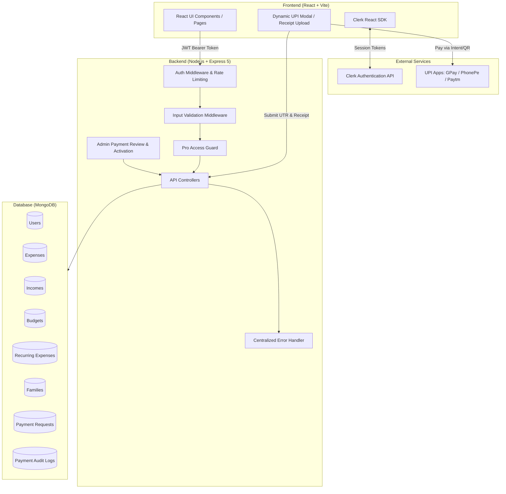

# Expense Tracker

A full-stack personal finance and expense management web application designed to track expenses, manage budgets, automate recurring transactions, and deliver actionable financial insights. Built with React (Vite), Node.js, Express, and MongoDB, with secure authentication via Clerk and a verified Manual UPI payment and administrative review workflow.

---

## Overview

Managing personal finances often involves juggling multiple spending categories, tracking variable incomes, monitoring monthly limits, and coordinating household expenses. 

**Expense Tracker** provides a centralized, responsive dashboard that simplifies this workflow:
- **Comprehensive Tracking**: Log, categorize, search, and paginate both income and expense transactions.
- **Budget Discipline**: Set category-specific monthly budget caps with live visual progress and overrun notifications.
- **Automation**: Schedule recurring bills (daily, weekly, monthly, yearly) that process automatically upon dashboard access.
- **Collaborative Tracking**: Create or join family groups to aggregate household spending and view member contributions.
- **Portfolio Demonstration**: Showcases production-grade engineering practices including server-side audit logs, dynamic UPI QR generation, strict input validation, centralized error handling, and automated integration test coverage.

---

## Features

### 💳 Expense & Income Management
- **Transaction Logging**: Record daily expenses and income entries with amount, category, date, and optional notes.
- **Filtering & Search**: Search transactions by keyword with regular expression escaping, filter by category or date range, and navigate via server-side pagination.
- **CRUD Operations**: Edit or delete transactions with strict user-ownership validation.

### 🎯 Budgeting & Category Limits
- **Monthly Category Budgets**: Assign spending limits to categories (e.g., Food, Transport, Utilities, Entertainment).
- **Progress Tracking**: Real-time calculation of spent amount vs. budget limit with visual color-coded progress bars.
- **Threshold Warnings**: Automatic notifications when spending approaches or exceeds 80% and 100% of defined budgets.

### 🔄 Automated Recurring Expenses
- **Interval Scheduling**: Set up automated recurring expenses with customizable frequencies (**Daily**, **Weekly**, **Monthly**, **Yearly**).
- **Catch-Up Processing**: Automatically computes and creates missed transactions if the user logs in after an interval date has passed.
- **Safe State Updates**: Advances the `nextDate` timestamp and logs `lastProcessed` records without duplication.

### 📊 Analytics & Visualizations
- **Monthly Cashflow Trends**: Interactive bar and area charts comparing income vs. expenses over rolling 6-month intervals (powered by Recharts).
- **Category Breakdown**: Interactive donut/pie charts illustrating spending distributions.
- **KPI Metrics**: Instant summary cards displaying Total Income, Total Expenses, Net Savings, and Savings Rate percentage.

### 🧠 Financial Health Score & Smart Alerts
- **Financial Health Score**: Deterministic algorithm evaluating savings consistency, expense-to-income ratio, and budget adherence on a 0–100 scale.
- **Heuristic Alerts**: Automated warning engine flagging category spending spikes and high expense-to-income ratios.

### 👨‍👩‍👧 Family & Group Expense Sharing
- **Family Groups**: Create a shared household group with an auto-generated invite code.
- **Member Aggregation**: View cumulative group spending alongside a breakdown of each member's individual contribution.

### 💎 Pro Membership (Manual UPI Workflow)
- **Feature Gating**: Pro-tier protection for advanced analytics, AI suggestions, and family group management via backend `requirePro` middleware.
- **Transparent Plans**: Monthly (₹149 / 30 days) and Yearly (₹999 / 365 days).
- **Dynamic QR Payment**: Generates compliant dynamic UPI intent links and QR codes with embedded payee credentials, amount, and transaction reference.
- **Two-Step Verification**: Users submit their 12-digit bank UTR and payment screenshot receipt.
- **Administrative Review & Activation**: Administrators verify submitted receipts and UTRs in the Admin Payment Dashboard. Server-side approval atomically activates Pro entitlements and records an immutable audit log.

### 📥 Data Export
- **Excel (.xlsx)**: Export formatted transaction ledgers using SheetJS (`xlsx`).
- **CSV**: Download raw transaction records for custom spreadsheet analysis.
- **PDF Reports**: Generate structured multi-page PDF financial statements using `jspdf` and `jspdf-autotable`.

---

## Tech Stack

### Frontend
- **Framework**: [React 19](https://react.dev/) with [Vite](https://vite.dev/)
- **Routing**: [React Router DOM v7](https://reactrouter.com/)
- **Authentication**: [@clerk/clerk-react](https://clerk.com/)
- **Charts & UI**: [Recharts](https://recharts.org/), [React Icons](https://react-icons.github.io/react-icons/), [qrcode.react](https://github.com/zpao/qrcode.react)
- **Export Utilities**: [SheetJS (xlsx)](https://sheetjs.com/), [jsPDF](https://github.com/parallax/jsPDF), [jspdf-autotable](https://github.com/simonbengtsson/jsPDF-AutoTable)
- **HTTP Client**: [Axios](https://axios-http.com/)

### Backend
- **Runtime**: [Node.js](https://nodejs.org/) (ES6+ / CommonJS)
- **Web Framework**: [Express 5](https://expressjs.com/)
- **Database ODM**: [Mongoose 9](https://mongoosejs.com/)
- **Authentication**: [@clerk/clerk-sdk-node](https://clerk.com/)
- **Security & Utilities**: `express-rate-limit`, `cors`, `dotenv`, `multer`, `sharp`

### Database
- **Engine**: [MongoDB](https://www.mongodb.com/) (Self-hosted or MongoDB Atlas)
- **Indexing**: Targeted compound indexes for optimized time-series, user-scoped lookups, and unique payment request tracking.

### Payments & Testing
- **Payment Method**: Manual UPI (Dynamic QR, UTR verification, Admin approval)
- **Test Runner**: Node.js Native Test Runner (`node:test`, `node:assert/strict`)
- **HTTP Testing**: [Supertest](https://github.com/ladjs/supertest)

---

## Architecture



---

## Security & Hardening

The codebase has undergone comprehensive security hardening:

1. **Manual UPI Payment Workflow & Verification**:
   - Upgrades to Pro follow a secure two-step manual verification workflow.
   - Users submit transaction UTR numbers and receipt screenshots after making UPI payments.
   - Pro entitlement is activated strictly server-side by authenticated administrators.
   - All development-mode bypasses and unverified client status activations are strictly prohibited.

2. **Strict Request Validation & Sanitization**:
   - Route parameters (`/:id`) are validated for valid 24-character hexadecimal MongoDB ObjectIds before database execution, preventing unhandled 500 CastErrors.
   - Input numbers are validated (positive, finite, realistic upper bounds).
   - Category strings are verified against an allowed whitelist (`VALID_CATEGORIES`).
   - Search parameters escape special regex characters to prevent ReDoS (Regular Expression Denial of Service).
   - Pagination parameters (`page`, `limit`) are strictly clamped.

3. **Production Error Masking**:
   - Centralized error-handling middleware catches all unhandled exceptions.
   - In production (`NODE_ENV=production`), internal schema definitions, stack traces, and database driver messages are masked from API clients while retaining structured server-side console logs.

4. **Traffic & Rate Control**:
   - `express-rate-limit` enforces rate limits on incoming API traffic.
   - Configured CORS policies restrict unauthorized cross-origin requests.

5. **Secrets & Environment Hygiene**:
   - All sensitive credentials and connection strings are managed through environment variables (`.env`).
   - `.env.example` templates are provided for both frontend and backend; local environment files are explicitly ignored in `.gitignore`.

---

## Database Performance & Indexes

Targeted compound indexes have been implemented to ensure rapid query execution and prevent full-collection scans:

| Collection | Index | Purpose |
| :--- | :--- | :--- |
| `Expense` | `{ user: 1, date: -1 }` | Fast user-scoped chronological queries, pagination, and monthly filtering |
| `Expense` | `{ family: 1 }` | Fast aggregation for family group spending breakdowns |
| `Income` | `{ user: 1, date: -1 }` | Optimized income history retrieval and dashboard cashflow calculations |
| `Budget` | `{ user: 1, month: 1, year: 1, category: 1 }` | Fast lookup of monthly budget limits per category |
| `RecurringExpense` | `{ user: 1, nextDate: 1 }` | Rapid batch discovery of overdue recurring expenses upon dashboard load |
| `PaymentRequest` | `{ utr: 1 }` (unique, sparse) | Prevents duplicate UTR submission across manual payment requests |

---

## Automated Testing

The backend includes a comprehensive automated test suite built using Node.js's native test runner (`node:test`) and `supertest`:

```bash
cd backend
npm test
```

### Test Coverage Areas:
- **API Security & Route Protection**: Verified health check endpoints, 404 handler responses, and 401 Unauthorized rejection for protected routes.
- **Admin Payment Approval Workflow**: Verified end-to-end admin review, approval idempotency, rejection, and Pro entitlement extension.
- **Manual UPI Payment Workflow**: Verified dynamic config, UTR submission, duplicate protection, and file upload safety.
- **Payment Gateway Removal**: Regression tests verifying removed Razorpay endpoints return 404 and cannot be exploited.
- **Pro Access Middleware**: Access enforcement for Pro-only endpoints.
- **Input Validation Helpers**: ObjectId format validation, amount bounds, date parsing, and pagination clamping.
- **Recurring Expense Processing**: Schema field integrity and date interval calculation (Daily, Weekly, Monthly, Yearly).

---

## Getting Started

### Prerequisites
- **Node.js**: v18.0.0 or higher (v20+ recommended)
- **MongoDB**: Local MongoDB server or free MongoDB Atlas URI
- **Clerk Account**: Free development application keys from [clerk.com](https://clerk.com)

---

### Installation

1. **Clone the repository**:
   ```bash
   git clone https://github.com/your-username/Expense_Tracker.git
   cd Expense_Tracker
   ```

2. **Backend Setup**:
   ```bash
   cd backend
   npm install
   cp .env.example .env
   ```
   Configure your `.env` variables:
   ```env
   PORT=5000
   NODE_ENV=development
   FRONTEND_URL=http://localhost:5173
   MONGO_URI=mongodb://localhost:27017/expense_tracker
   CLERK_SECRET_KEY=sk_test_your_clerk_secret_key
   CLERK_PUBLISHABLE_KEY=pk_test_your_clerk_publishable_key
   UPI_PAYEE_VPA=fintrack@upi
   UPI_PAYEE_NAME=FinTrack Financials
   ```

3. **Frontend Setup**:
   ```bash
   cd ../frontend
   npm install
   cp .env.example .env
   ```
   Configure your `.env` variables:
   ```env
   VITE_API_URL=http://localhost:5000/api
   VITE_CLERK_PUBLISHABLE_KEY=pk_test_your_clerk_publishable_key
   ```

---

### Running Locally

1. **Start the Backend API**:
   ```bash
   cd backend
   npm start
   # Server runs on http://localhost:5000
   ```

2. **Start the Frontend Development Server**:
   ```bash
   cd frontend
   npm run dev
   # App runs on http://localhost:5173
   ```

3. **Build Frontend for Production**:
   ```bash
   cd frontend
   npm run build
   ```

---

## Project Structure

```
Expense_Tracker/
├── backend/
│   ├── config/             # Database connection configuration
│   ├── controllers/        # Request handling and business logic
│   │   ├── adminDashboardController.js
│   │   ├── adminPaymentController.js
│   │   ├── budgetController.js
│   │   ├── expenseController.js
│   │   ├── familyController.js
│   │   ├── incomeController.js
│   │   ├── paymentRequestController.js
│   │   └── userController.js
│   ├── middleware/         # Express middleware
│   │   ├── authMiddleware.js
│   │   ├── errorHandler.js
│   │   ├── proMiddleware.js
│   │   ├── uploadMiddleware.js
│   │   └── validation.js
│   ├── models/             # Mongoose schemas & indexes
│   │   ├── Budget.js
│   │   ├── Expense.js
│   │   ├── Family.js
│   │   ├── Income.js
│   │   ├── PaymentAudit.js
│   │   ├── PaymentRequest.js
│   │   ├── RecurringExpense.js
│   │   └── User.js
│   ├── routes/             # API route definitions
│   ├── tests/              # Automated unit & integration tests
│   ├── utils/              # Helper utilities
│   ├── .env.example        # Backend environment template
│   ├── package.json
│   └── server.js           # Main Express server entrypoint
│
├── frontend/
│   ├── src/
│   │   ├── components/     # Reusable UI components
│   │   │   ├── Charts.jsx
│   │   │   ├── DashboardAlerts.jsx
│   │   │   ├── MonthlyBudgetCard.jsx
│   │   │   ├── TransactionTable.jsx
│   │   │   ├── UpgradeModal.jsx
│   │   │   └── UpiPaymentModal.jsx
│   │   ├── context/        # React context providers (ProContext)
│   │   ├── pages/          # Application views
│   │   │   ├── AddExpense.jsx
│   │   │   ├── AddIncome.jsx
│   │   │   ├── AdminDashboard.jsx
│   │   │   ├── Budget.jsx
│   │   │   ├── Dashboard.jsx
│   │   │   ├── Family.jsx
│   │   │   ├── LandingPage.jsx
│   │   │   └── Profile.jsx
│   │   ├── utils/          # API client & data export utilities
│   │   ├── App.jsx
│   │   └── main.jsx
│   ├── .env.example        # Frontend environment template
│   ├── package.json
│   └── vite.config.js
│
├── .gitignore
└── README.md
```

---

## License

This project is open-source and available under the [ISC License](file:///c:/Users/mp429/Desktop/Expense_Tracker-main/backend/package.json).
